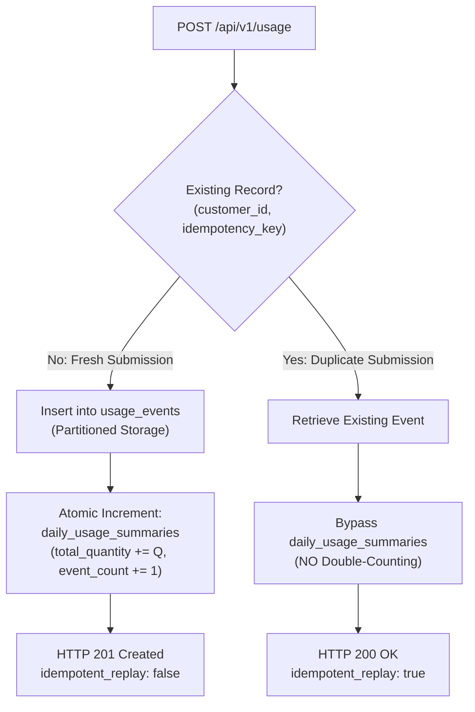

# API Reference: Ingestion Pipeline & Idempotency Engine (Phase 2)

## 1. Overview

The Usage Metering Ingestion Pipeline provides a high-throughput, strictly idempotent HTTP endpoint for recording resource consumption events (API calls, storage, compute seconds, bandwidth, database operations) against customers.

### Base URL
```
https://{host}/api/v1
```

### Postman Workspace Collection & Environment
- **Collection**: [`postman/Mallow_Billing_System.postman_collection.json`](../postman/Mallow_Billing_System.postman_collection.json)
- **Environment**: [`postman/Mallow_Billing_System.postman_environment.json`](../postman/Mallow_Billing_System.postman_environment.json)
- **Setup Guide**: [`docs/POSTMAN_SETUP.md`](POSTMAN_SETUP.md)

Import both files into Postman to test all endpoints with pre-configured headers, valid seeded UUIDs, and automated assertions. See [`docs/POSTMAN_SETUP.md`](POSTMAN_SETUP.md) for full configuration steps.

### Interactive API Web Console & Playground
An interactive browser-based testing console is integrated directly into the application at:
- **Universal Console**: [`/console`](http://127.0.0.1:8000/console)
- **Merchant-Scoped Console**: [`/merchants/{merchant}/console`](http://127.0.0.1:8000/merchants)

The console provides real-time form submission for `POST /api/v1/usage`, customer selectors, dynamic idempotency key generation, duplicate replay testing, and live JSON response inspection with HTTP status codes and latency.

---

## 2. Authentication & Rate Limiting

### Headers
| Header | Type | Description | Required |
| :--- | :--- | :--- | :--- |
| `X-API-Key` | String | API key identifying the calling merchant/service | Yes (recommended) |
| `Authorization` | String | Alternative bearer token (`Bearer <token>`) | Optional |
| `Content-Type` | String | Must be `application/json` | Yes |
| `Accept` | String | Must be `application/json` | Yes |

### Rate Limiting Policy
- **Threshold**: **120 requests per minute per API key**.
- The rate limiter evaluates `X-API-Key`, falling back to the `Authorization` Bearer token or client IP if unauthenticated.
- **HTTP 429 Response Headers**:
  - `X-RateLimit-Limit`: Maximum requests per window (e.g. `120`).
  - `X-RateLimit-Remaining`: Remaining requests in current 60-second window.
  - `Retry-After`: Seconds to wait before retrying.

#### HTTP 429 Response Example
```json
{
  "message": "Too Many Attempts."
}
```

---

## 3. Record Usage Event Endpoint

### `POST /api/v1/usage`

Ingests a usage meter event idempotently.

#### Request Parameters
| Field | Type | Rules | Description |
| :--- | :--- | :--- | :--- |
| `customer_id` | UUID | Required, exists in `customers.id` | The ID of the customer generating the usage |
| `metric_identifier` | String | Required, string, max 64 chars | Identifier of the metered metric (e.g. `api_requests`, `compute_seconds`, `storage_gb`) |
| `quantity` | Integer | Required, integer, minimum `1` | Number of units consumed |
| `idempotency_key` | String | Required, string, max 128 chars | Unique identifier for deduplication |
| `timestamp` | ISO8601 String | Optional, valid date format | Timestamp of event occurrence (defaults to current server time `now()`) |
| `properties` | Object | Optional, key-value JSON map | Arbitrary event metadata (e.g. `{"region": "us-east-1", "endpoint": "/search"}`) |

---

### Request Example (cURL)
```bash
curl -X POST https://billing.example.com/api/v1/usage \
  -H "X-API-Key: live_api_key_88f921ab" \
  -H "Content-Type: application/json" \
  -H "Accept: application/json" \
  -d '{
    "customer_id": "9d9842a2-8f65-4f0f-8706-e781c81cf262",
    "metric_identifier": "api_requests",
    "quantity": 150,
    "idempotency_key": "evt_order_created_9921",
    "timestamp": "2026-09-27T10:00:00Z",
    "properties": {
      "endpoint": "/v1/orders",
      "method": "POST",
      "status_code": 201
    }
  }'
```

---

## 4. Idempotency & Replay Mechanics

The engine guarantees **exact-once processing semantics** via the composite unique key `(customer_id, idempotency_key)`:



### Scenario A: Fresh Submission (`HTTP 201 Created`)
When a submission is received with a new `(customer_id, idempotency_key)`:
1. Event is written to partitioned `usage_events`.
2. The daily pre-aggregate record in `daily_usage_summaries` is atomically incremented by `quantity`.
3. Returns `HTTP 201 Created`.

#### Response Body (`201 Created`)
```json
{
  "data": {
    "id": "c1f72782-b7b5-4b57-a3f2-8704257be7bb",
    "merchant_id": "8f88ef80-1a77-4c48-a006-2586a117b8f9",
    "customer_id": "9d9842a2-8f65-4f0f-8706-e781c81cf262",
    "metric_identifier": "api_requests",
    "quantity": 150,
    "idempotency_key": "evt_order_created_9921",
    "timestamp": "2026-09-27T10:00:00.000000Z",
    "properties": {
      "endpoint": "/v1/orders",
      "method": "POST",
      "status_code": 201
    },
    "created_at": "2026-09-27T10:00:01.000000Z"
  },
  "idempotent_replay": false
}
```

---

### Scenario B: Duplicate Submission / Replay (`HTTP 200 OK`)
When network retries or client errors replay a previously submitted `(customer_id, idempotency_key)`:
1. The system detects the existing record.
2. **Zero writes to `daily_usage_summaries`**: Counters are NOT incremented, completely eliminating duplicate unit counting.
3. The original event record is returned with `idempotent_replay: true` and `HTTP 200 OK`.

#### Response Body (`200 OK`)
```json
{
  "data": {
    "id": "c1f72782-b7b5-4b57-a3f2-8704257be7bb",
    "merchant_id": "8f88ef80-1a77-4c48-a006-2586a117b8f9",
    "customer_id": "9d9842a2-8f65-4f0f-8706-e781c81cf262",
    "metric_identifier": "api_requests",
    "quantity": 150,
    "idempotency_key": "evt_order_created_9921",
    "timestamp": "2026-09-27T10:00:00.000000Z",
    "properties": {
      "endpoint": "/v1/orders",
      "method": "POST",
      "status_code": 201
    },
    "created_at": "2026-09-27T10:00:01.000000Z"
  },
  "idempotent_replay": true
}
```

---

## 5. Validation Error Schemas (`HTTP 422`)

If invalid parameters are supplied:
```json
{
  "message": "The customer id field is required. (and 2 more errors)",
  "errors": {
    "customer_id": [
      "The customer id field must be a valid UUID."
    ],
    "quantity": [
      "The quantity field must be at least 1."
    ],
    "idempotency_key": [
      "The idempotency key field is required."
    ]
  }
}
```

---

## 6. Merchant Dashboard Endpoints

### 6.1 Visual Dashboard Web View
`GET /merchants/{merchant}/dashboard`

Renders the visual, high-scale Blade/Tailwind CSS dashboard for merchants matching the assignment wireframe specification.

#### Route
```http
GET /merchants/{merchant_id}/dashboard HTTP/1.1
Host: billing.example.com
Accept: text/html
```

#### Visual Wireframe Components
1. **Header Banner**: Dark navigation header displaying merchant name and `WIREFRAME — layout reference only` badge.
2. **Current Cycle Usage**: Progress card showing consumed cycle units vs total plan quota (e.g. `184,320 / 250,000 units`) with blue accent border.
3. **Projected Overage Revenue**: Card estimating end-of-cycle overage charges based on active cycle burn rate ($(\text{daily burn rate} \times \text{cycle days} - \text{allowance}) \times \text{overage rate}$) with orange accent border.
4. **Active Plan**: Plan name and cadence (e.g. `Growth — monthly`) with emerald accent border.
5. **Top 5 Customers by Usage**: Cycle table listing highest consumers, total units used, and percentage of allowance consumed.
6. **Daily Usage Trend**: 30-day continuous time-series chart rendered via Chart.js with smooth spline curves and hidden x-axis ticks.
7. **Churn Risk Alerts**: Dedicated alert panel flagging accounts exhibiting a greater than 50% Month-over-Month (MoM) usage drop.
8. **System Status**: Informational box outlining Redis plan cache (10m TTL), queued nightly chunked aggregation (`chunkById(5000)`), and API rate limits (120 req/min).

#### Scale Safeguard & Query Performance Notes
- **Zero Raw Event Scans**: All queries read exclusively from the indexed `daily_usage_summaries` table (`INDEX (merchant_id, usage_date)`).
- **Sub-10ms Page Loads**: By eliminating scans over 50L+ raw event records in `usage_events`, the web view executes only bounded aggregation lookups over at most 30 to 60 summary rows, ensuring lightning-fast execution and zero database lockup.

---

### 6.2 Merchant Dashboard REST API
`GET /api/v1/merchants/{id}/dashboard`

Returns the operational and revenue metrics as structured JSON for programmatic consumption.

#### Response Example (`200 OK`)
```json
{
  "data": {
    "merchant_id": "01923e20-302a-7f61-b51c-4b68e987c2b4",
    "merchant_name": "Acme Corp",
    "currency": "INR",
    "as_of_date": "2026-09-27T18:25:00.000000Z",
    "cycle_usage": {
      "total_usage_units": 184320,
      "total_included_units": 250000,
      "consumption_percentage": 73.73
    },
    "projected_overage_revenue": {
      "incurred_cents": 0,
      "incurred_formatted": "INR 0.00",
      "projected_cents": 4260000,
      "projected_formatted": "INR 42600.00"
    },
    "top_customers_by_usage": [
      {
        "customer_id": "01923e21-0a1b-7a32-8df3-7649d6781290",
        "customer_name": "Beta Retail Pvt Ltd",
        "plan_name": "Growth",
        "used_units": 38200,
        "allowance_units": 41666,
        "percentage_consumed": 91.68,
        "incurred_overage_cents": 0,
        "projected_overage_cents": 0,
        "currency": "INR"
      }
    ],
    "churn_risk_customers": [
      {
        "customer_id": "01923e21-0a1b-7a32-8df3-7649d6781291",
        "customer_name": "Nova Traders",
        "previous_period_usage": 50000,
        "current_period_usage": 19000,
        "drop_percentage": 62.0,
        "risk_level": "high"
      }
    ]
  }
}
```

