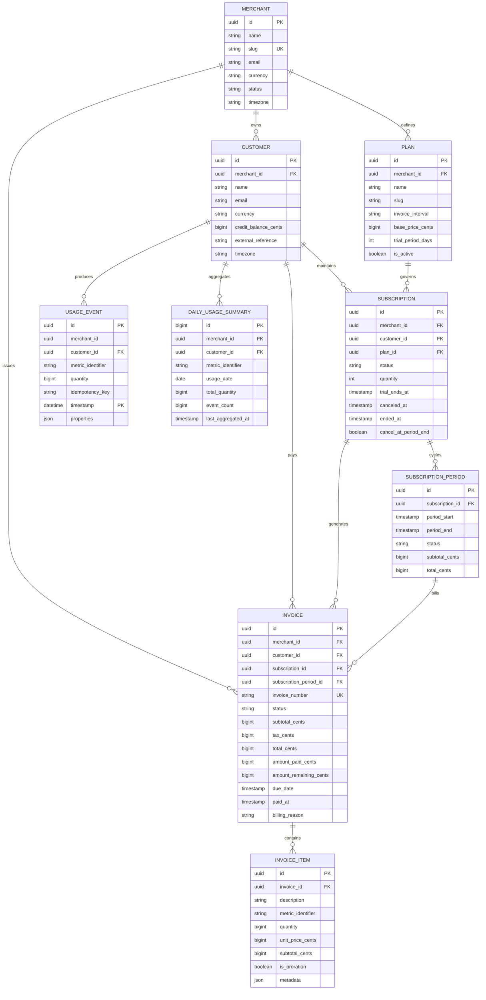
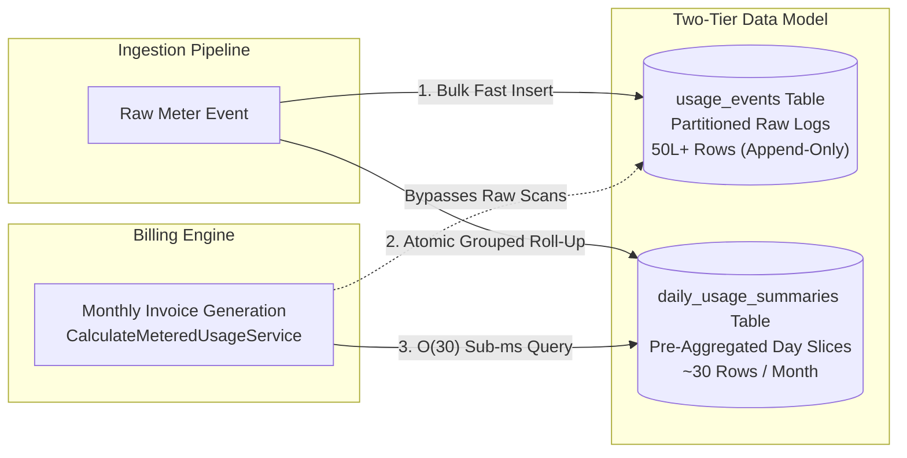

# Architecture & High-Scale Database Schema (Phase 1)

## 1. Domain & Entity Architecture

The **Subscription Billing & Usage-Metering System** is organized around an isolated, multi-tenant hierarchy designed for SaaS platforms, cloud providers, and API platforms:



---

## 2. High-Scale Engineering for 50L+ (5,000,000+) Raw Records

### 2.1 The Challenge of High-Volume Metering
High-throughput systems (API gateways, compute engines, storage clusters) ingest hundreds of raw meter records per second, generating **50 Lakhs+ (5,000,000+) rows per customer per billing cycle**.

Naïve implementations fail at this scale due to:
1. **Index Contention & Lock Serialization**: Concurrent insertions into a single monolithic B-Tree index cause lock amplification, cache thrashing, and high insert latency.
2. **Exhaustive Table Scans During Invoicing**: Running queries like `SELECT SUM(quantity) FROM usage_events WHERE customer_id = ? AND timestamp BETWEEN ? AND ?` across 5,000,000+ unpartitioned rows forces the database to scan millions of records, degrading buffer pools and stalling billing cron jobs.
3. **Data Retention Deletion Overhead**: Deleting millions of historical records with standard `DELETE` statements triggers huge rollback segments, transaction locks, and binary log bloat.

---

### 2.2 Table Range Partitioning on `usage_events.timestamp`

To solve insert contention and query degradation, `usage_events` uses **Physical Range Partitioning** keyed by the timestamp column:

```sql
ALTER TABLE usage_events PARTITION BY RANGE (UNIX_TIMESTAMP(`timestamp`)) (
    PARTITION p_2026_q1 VALUES LESS THAN (UNIX_TIMESTAMP('2026-04-01 00:00:00')),
    PARTITION p_2026_q2 VALUES LESS THAN (UNIX_TIMESTAMP('2026-07-01 00:00:00')),
    PARTITION p_2026_q3 VALUES LESS THAN (UNIX_TIMESTAMP('2026-10-01 00:00:00')),
    PARTITION p_2026_q4 VALUES LESS THAN (UNIX_TIMESTAMP('2027-01-01 00:00:00')),
    PARTITION p_future  VALUES LESS THAN MAXVALUE
);
```

#### Key Architecture Benefits:
1. **Partition Pruning**:
   When reading usage within a billing cycle window (e.g. September 1 to October 1, 2026), the SQL optimizer automatically prunes all partitions outside `p_2026_q3`. The query engine touches **only** the relevant physical partition file, completely skipping millions of historical rows in older partitions.
2. **Instant Historical Data Dropping**:
   Data retention policies (e.g. retaining raw logs for 90 days after daily roll-up) do not execute heavy row-by-row `DELETE` statements. Instead, an instantaneous metadata command drops the entire physical segment:
   ```sql
   ALTER TABLE usage_events DROP PARTITION p_2026_q1;
   ```
   This operation executes in milliseconds without taking row locks or writing undo log entries.
3. **Composite Index Structure**:
   - `PRIMARY KEY (id, timestamp)`: Conforms to MySQL partitioning rules requiring the partitioning expression to reside within the primary key.
   - `INDEX (customer_id, timestamp)`: Enables ultra-fast point lookups and range scans constrained to a specific customer within the partition.
   - `UNIQUE (customer_id, idempotency_key, timestamp)`: Guarantees distributed ingestion idempotency without duplicate event double-counting.

---

### 2.3 Roll-Up Aggregation Strategy (Avoiding Raw Event Scans)

The system enforces a **Two-Tier Storage & Query Architecture**:



#### Execution Mechanics:
1. **Atomic Grouped Increment on Ingestion**:
   As batches of events are ingested, counts are grouped in memory by `(customer_id, metric_identifier, usage_date)`.
   The `daily_usage_summaries` table is atomically incremented:
   ```sql
   INSERT INTO daily_usage_summaries 
       (id, merchant_id, customer_id, metric_identifier, usage_date, total_quantity, event_count, last_aggregated_at)
   VALUES 
       (NULL, ?, ?, 'api_requests', '2026-09-27', 1500, 15, NOW())
   ON DUPLICATE KEY UPDATE 
       total_quantity = total_quantity + VALUES(total_quantity),
       event_count = event_count + VALUES(event_count),
       last_aggregated_at = NOW();
   ```
2. **Sub-Millisecond Invoicing ($O(30)$ Complexity)**:
   When billing cycles close, the billing engine executes:
   ```sql
   SELECT SUM(total_quantity) 
   FROM daily_usage_summaries 
   WHERE customer_id = '...' 
     AND metric_identifier = 'api_requests'
     AND usage_date BETWEEN '2026-09-01' AND '2026-09-30';
   ```
   **Performance Comparison**:
   - **Direct Scan**: Scans up to **5,000,000 rows** across disk, taking seconds.
   - **Roll-Up Summary**: Scans exactly **30 pre-aggregated rows** via primary/unique index in **< 0.5 ms**.

---

## 3. Strict Integer Cent Currency Modeling

To eliminate IEEE-754 floating-point errors (e.g. `0.1 + 0.2 = 0.30000000000000004`):
- All database columns (`base_price_cents`, `credit_balance_cents`, `subtotal_cents`, `tax_cents`, `total_cents`, `amount_paid_cents`, `amount_remaining_cents`, `unit_price_cents`) are strictly typed as `BIGINT`.
- All financial calculations execute in integer cents.
- Downgrades and early cancellations preserve fractional values by banking whole integer credits into `customers.credit_balance_cents`, rolling over seamlessly to offset subsequent invoices.
