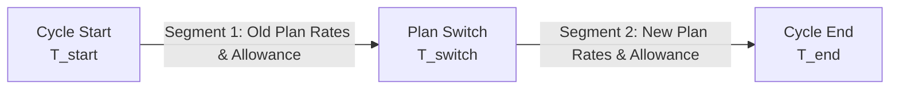

# Mathematical Derivations & Proration Mechanics (Phase 3)

## 1. Executive Overview

This document formalizes the mathematical principles governing **mid-cycle signups** and **mid-cycle plan transitions (upgrades/downgrades)** within the billing engine.

All financial transactions are calculated strictly in **integer cents** using symmetric round-half-up mechanics to eliminate floating-point drift:
$$\text{round}(x) = \lfloor x + 0.5 \rfloor$$

---

## 2. Proration for Mid-Cycle Signups

When a customer subscribes mid-cycle (e.g. joining on the 10th of a month where the billing anchor is the 1st of each month):

### 2.1 Variables
- $T_{\text{start}}$: Unix timestamp of cycle start.
- $T_{\text{end}}$: Unix timestamp of cycle end ($T_{\text{end}} > T_{\text{start}}$).
- $T_{\text{signup}}$: Unix timestamp of customer activation ($T_{\text{start}} \le T_{\text{signup}} < T_{\text{end}}$).
- $T_{\text{total}} = T_{\text{end}} - T_{\text{start}}$: Total seconds in standard cycle.
- $T_{\text{active}} = T_{\text{end}} - T_{\text{signup}}$: Remaining active seconds in first cycle.
- $B$: Full-cycle plan base price in **integer cents**.
- $A$: Full-cycle included usage allowance units.
- $Q$: Number of subscription seats/licenses.

### 2.2 Active Ratio
$$R_{\text{active}} = \frac{T_{\text{active}}}{T_{\text{total}}} = \frac{T_{\text{end}} - T_{\text{signup}}}{T_{\text{end}} - T_{\text{start}}}$$

### 2.3 Prorated Base Fee ($\text{Fee}_{\text{signup}}$)
$$\text{Fee}_{\text{signup}} = \left\lfloor B \times Q \times \frac{T_{\text{active}}}{T_{\text{total}}} + 0.5 \right\rfloor$$

### 2.4 Prorated Included Allowance ($A_{\text{signup}}$)
$$A_{\text{signup}} = \left\lfloor A \times Q \times \frac{T_{\text{active}}}{T_{\text{total}}} + 0.5 \right\rfloor$$

Any metered consumption exceeding $A_{\text{signup}}$ during the remaining period $[T_{\text{signup}}, T_{\text{end}})$ is billed at the plan's overage unit rate.

---

## 3. Mid-Cycle Plan Transitions (Segmented Model)

When a customer upgrades or downgrades mid-cycle, the single billing period $[T_{\text{start}}, T_{\text{end}})$ is split into **two independent consecutive segments**:
$$[T_{\text{start}}, T_{\text{end}}) = [T_{\text{start}}, T_{\text{switch}}) \;\cup\; [T_{\text{switch}}, T_{\text{end}})$$

### 3.1 Segment 1 (Old Plan: $P_{\text{old}}$)
- **Duration**: $T_1 = T_{\text{switch}} - T_{\text{start}}$
- **Segment 1 Ratio**:
  $$R_1 = \frac{T_1}{T_{\text{total}}} = \frac{T_{\text{switch}} - T_{\text{start}}}{T_{\text{end}} - T_{\text{start}}}$$
- **Prorated Base Fee 1**:
  $$B_1 = \left\lfloor B_{\text{old}} \times Q \times R_1 + 0.5 \right\rfloor$$
- **Prorated Allowance 1**:
  $$A_1 = \left\lfloor A_{\text{old}} \times Q \times R_1 + 0.5 \right\rfloor$$
- **Overage Rate 1**: Old plan rate ($r_{\text{old}}$) applies strictly to usage within $[T_{\text{start}}, T_{\text{switch}})$.

---

### 3.2 Segment 2 (New Plan: $P_{\text{new}}$)
- **Duration**: $T_2 = T_{\text{end}} - T_{\text{switch}}$
- **Segment 2 Ratio**:
  $$R_2 = \frac{T_2}{T_{\text{total}}} = \frac{T_{\text{end}} - T_{\text{switch}}}{T_{\text{end}} - T_{\text{start}}} = 1 - R_1$$
- **Prorated Base Fee 2**:
  $$B_2 = \left\lfloor B_{\text{new}} \times Q \times R_2 + 0.5 \right\rfloor$$
- **Prorated Allowance 2**:
  $$A_2 = \left\lfloor A_{\text{new}} \times Q \times R_2 + 0.5 \right\rfloor$$
- **Overage Rate 2**: New plan rate ($r_{\text{new}}$) applies strictly to usage within $[T_{\text{switch}}, T_{\text{end}})$.

---

### 3.3 Financial Settlement Ledger

The customer prepaid or committed $B_{\text{old}} \times Q$ at cycle start.

1. **Unused Credit from Old Plan**:
   $$C_{\text{unused}} = \left\lfloor B_{\text{old}} \times Q \times R_2 + 0.5 \right\rfloor$$
   *(Conservation property: $B_1 + C_{\text{unused}} = B_{\text{old}} \times Q$)*

2. **Charge for New Plan**:
   $$D_{\text{charge}} = B_2 = \left\lfloor B_{\text{new}} \times Q \times R_2 + 0.5 \right\rfloor$$

3. **Net Proration Adjustment ($\Delta_{\text{net}}$)**:
   $$\Delta_{\text{net}} = D_{\text{charge}} - C_{\text{unused}}$$

- **Upgrade ($\Delta_{\text{net}} > 0$)**: Customer owes an immediate adjustment of $\Delta_{\text{net}}$ cents.
- **Downgrade ($\Delta_{\text{net}} < 0$)**: Customer account is credited with $|\Delta_{\text{net}}|$ cents (`customers.credit_balance_cents += abs(netAdjustment)`).

---

## 4. Step-by-Step Worked Numerical Example

### Scenario Parameters
- **Billing Cycle**: June 1, 2026 00:00:00 to July 1, 2026 00:00:00
  - Duration: $30$ days = $2,592,000$ seconds.
- **Old Plan (Starter)**:
  - Base Fee: $\$30.00$ ($3000$ cents) / month
  - Included Allowance: $10,000$ units
  - Overage Unit Rate: $\$0.05$ ($5$ cents) / unit
  - Seats ($Q$): $1$
- **New Plan (Pro)**:
  - Base Fee: $\$90.00$ ($9000$ cents) / month
  - Included Allowance: $50,000$ units
  - Overage Unit Rate: $\$0.02$ ($2$ cents) / unit
- **Switch Time ($T_{\text{switch}}$)**: June 16, 2026 00:00:00 (exact 50% midpoint).

---

### Step 1: Durations and Segment Ratios
$$T_1 = 15 \text{ days} = 1,296,000 \text{ seconds}$$
$$T_2 = 15 \text{ days} = 1,296,000 \text{ seconds}$$
$$R_1 = \frac{1,296,000}{2,592,000} = 0.50$$
$$R_2 = \frac{1,296,000}{2,592,000} = 0.50$$

---

### Step 2: Segment 1 (Starter Plan) Calculations
- **Prorated Base Fee**:
  $$B_1 = \lfloor 3000 \times 1 \times 0.50 + 0.5 \rfloor = 1500 \text{ cents } (\$15.00)$$
- **Prorated Allowance**:
  $$A_1 = \lfloor 10,000 \times 1 \times 0.50 + 0.5 \rfloor = 5000 \text{ units}$$
- **Overage Rate**: $5$ cents per unit beyond $5000$ units during Segment 1.

---

### Step 3: Segment 2 (Pro Plan) Calculations
- **Prorated Base Fee**:
  $$B_2 = \lfloor 9000 \times 1 \times 0.50 + 0.5 \rfloor = 4500 \text{ cents } (\$45.00)$$
- **Prorated Allowance**:
  $$A_2 = \lfloor 50,000 \times 1 \times 0.50 + 0.5 \rfloor = 25,000 \text{ units}$$
- **Overage Rate**: $2$ cents per unit beyond $25,000$ units during Segment 2.

---

### Step 4: Net Adjustment & Balance Settlement
- **Unused Credit from Starter**:
  $$C_{\text{unused}} = \lfloor 3000 \times 0.50 + 0.5 \rfloor = 1500 \text{ cents } (\$15.00)$$
- **New Charge for Pro**:
  $$D_{\text{charge}} = 4500 \text{ cents } (\$45.00)$$
- **Net Amount Customer Owes**:
  $$\Delta_{\text{net}} = 4500 - 1500 = +3000 \text{ cents } (+\$30.00)$$

**Database Updates**:
1. Active `subscription_periods` for Segment 1 is closed with `period_end = 2026-06-16 00:00:00`, `prorated_base_price_cents = 1500`, and `prorated_allowance_units = 5000`.
2. New `subscription_periods` for Segment 2 is opened with `period_start = 2026-06-16 00:00:00`, `period_end = 2026-07-01 00:00:00`, `prorated_base_price_cents = 4500`, and `prorated_allowance_units = 25000`.
3. Customer invoice or card charge is generated for **$30.00**.
